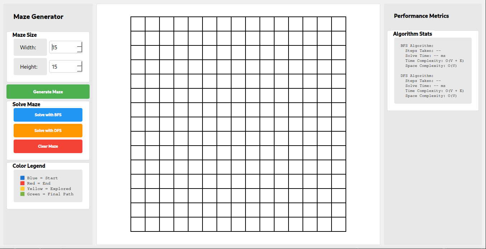
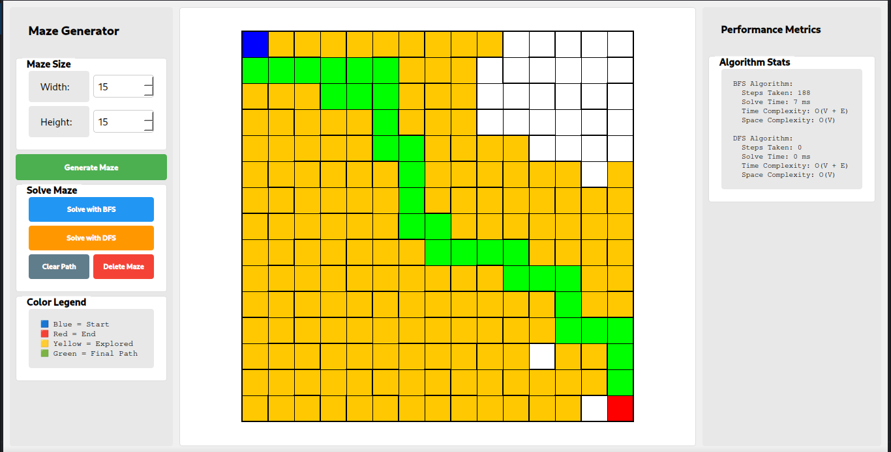

# Maze PathFinder - DSA Final Project
### University of Sargodha - 3rd Semester Final Lab Project

A high-performance C++ application visualizing advanced Data Structures and Algorithms. This project demonstrates **Maze Generation** using Kruskal's Algorithm (with Union-Find) and **Pathfinding** using BFS and DFS.

---

## 📸 Project Screenshots

| **Starting Interface** | **Solved Maze** |
|:---:|:---:|
|  |  |
| *Clean GUI with control panel and metrics* | *Visualized pathfinding process* |

> **Visual Guide:** As seen in the "Solved Maze" screenshot above, the **Yellow cells** represent the nodes explored by the algorithm during its search, while the **Green path** highlights the final solution found from Start (Blue) to End (Red).

---

## 🚀 Features

*   **Maze Generation with Cycles:** Uses **Randomized Kruskal's Algorithm** to create the base structure, but intentionally removes extra walls to create loops. This ensures multiple paths exist, allowing for a true comparison between BFS and DFS.
*   **Interactive Pathfinding:**
    *   **BFS (Breadth-First Search):** Guarantees the shortest path.
    *   **DFS (Depth-First Search):** Explores deep branches first.
*   **Real-time Visualization:** Watch the algorithms work step-by-step.
*   **Performance Metrics:** Live tracking of:
    *   Steps Taken (Cells visited)
    *   Execution Time (ms)
    *   Time & Space Complexity display

---

## 🧠 Algorithms Implemented

### 1. Disjoint Set (Union-Find)
The core data structure behind the maze generation. It efficiently tracks connected components of the maze cells.
*   **Optimizations:** Implements **Path Compression** and **Union by Rank** for nearly $O(1)$ operations.
*   **Usage:** Prevents cycles during wall removal to ensure a "Perfect Maze" (Spanning Tree) structure.

### 2. Randomized Kruskal's Algorithm
Originally for Minimum Spanning Trees (MST), adapted here for maze generation:
1.  Treat the grid as a graph where walls are edges.
2.  Randomize the order of all walls.
3.  Iterate through walls: if removing a wall connects two previously unconnected cells (checked via Union-Find), remove it.
4.  Result: A random spanning tree of the grid.

> **Note:** To better demonstrate the difference between BFS and DFS, we post-process the maze by removing a few additional random walls. This creates **cycles** (loops) in the graph, providing multiple routes to the destination so you can see BFS find the shortest one while DFS might take a longer route.

### 3. Pathfinding Solvers

| Algorithm | Type | Guarantee | Behavior |
| :--- | :--- | :--- | :--- |
| **BFS** | Queue (FIFO) | **Shortest Path** | Explores layer-by-layer (concentric circles). Best for finding the optimal route. |
| **DFS** | Stack (LIFO) | Path Exists | Explores as deep as possible before backtracking. Often produces long, winding paths. |

---

## 🛠️ Technical Stack

*   **Language:** C++ (C++17 Standard)
*   **GUI Framework:** Qt 6
*   **Build System:** CMake
*   **Key Concepts:** Graph Theory, Spanning Trees, Queue/Stack Data Structures.

## 📂 Project Structure

```
src/
├── main.cpp           # Entry point
├── mainwindow.cpp     # GUI Logic & Event Handling
├── mazescene.cpp      # Graphics rendering of the grid
├── maze.cpp           # Kruskal's Algorithm Implementation
├── unionfind.cpp      # Disjoint Set Data Structure
└── pathfinder.cpp     # BFS and DFS Implementations
```

## 🔧 How to Build & Run

**Prerequisites:**
*   C++ Compiler (GCC/Clang/MSVC)
*   CMake
*   Qt 6 Development Libraries

**Build Steps:**
```bash
mkdir build
cd build
cmake ..
make
./MazeGenerator
```

---

## 👨‍💻 About

**Course:** Data Structures and Algorithms (DSA)  
**Institution:** University of Sargodha  
**Semester:** 3rd Semester  

This project serves as a practical demonstration of graph algorithms in a visual, interactive environment.
